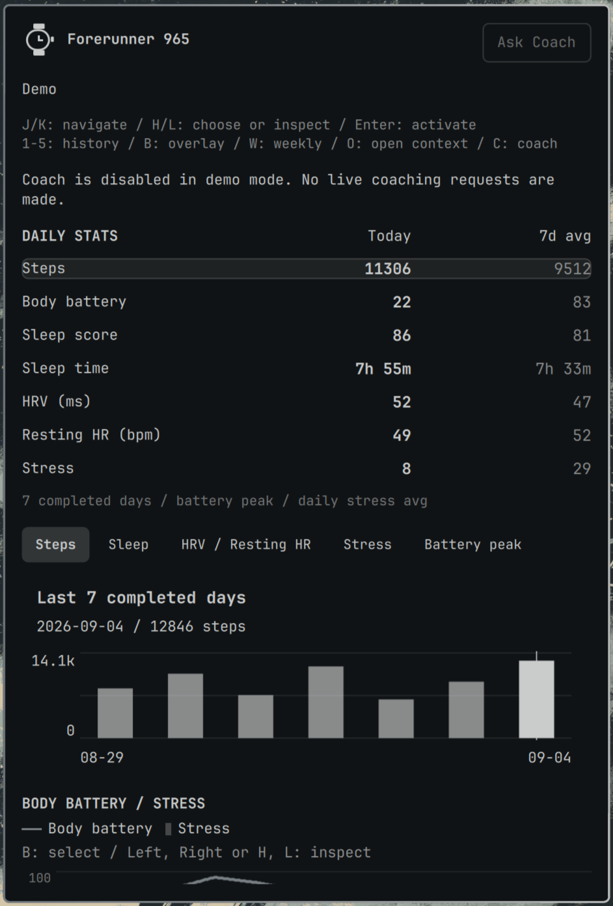
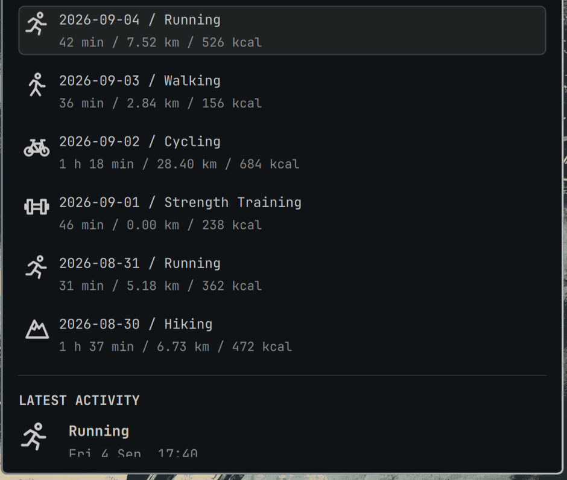
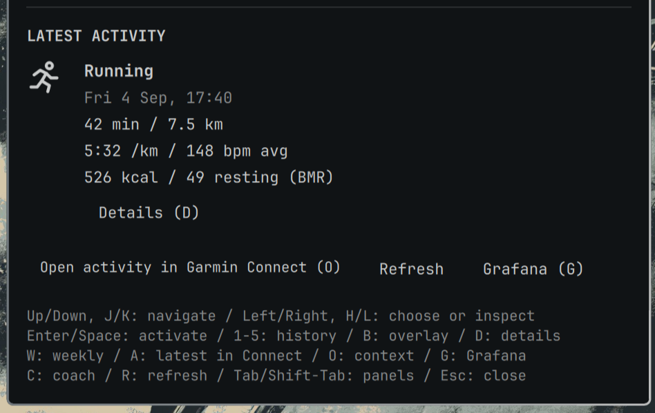

# Garmin Glance

**Your Garmin health and activities, at a glance in Omarchy.**

<p align="center">
  
</p>

<p align="center"><sub>Demo data shown. A native panel, one click from your bar.</sub></p>

- **A glance, not another dashboard tab.** Steps, sleep, HRV, resting HR and
  stress, with seven-day averages/history and a Body Battery/stress overlay.
- **Your activities, close at hand.** Latest-activity details and a seven-day
  overview of recorded count, elapsed hours, calories and activity types.
  Distance stays grouped by type, never combined across sports.
- **Go deeper when you want.** Open the exact activity in Garmin Connect in
  your browser, or related stats and verified GPS views in Grafana.
- **Made for your desktop.** Native Omarchy styling and keyboard navigation,
  with no browser tab needed for your daily check-in.
- **Try it before connecting.** Explore a clearly labelled, offline demo with
  no database or Garmin account required.
- **Coaching, only by consent.** Optionally share a chosen time window with
  your existing agent to plan your day or review your week. Nothing launches
  automatically; you review the disclosure and approve each handoff.

<table>
  <tr>
    <th width="50%">Activities at a glance</th>
    <th width="50%">Your latest activity</th>
  </tr>
  <tr>
    <td valign="top"></td>
    <td valign="top"></td>
  </tr>
</table>

## Try It First

Requires **Omarchy 4** and **Python 3.9+** with timezone data; no pip packages.
Review the source before enabling: **plugins run unsandboxed as your user**.

For a fresh install without a connection file:

```bash
omarchy plugin add https://github.com/glavman/omarchy-garmin-glance.git
omarchy plugin enable io.github.glavman.garmin-glance
```

Click the watch icon. If
`~/.config/omarchy-garmin-glance/connection.json` is missing, Garmin Glance
automatically shows a **clearly labelled demo**. Once installed, preview has
**no network dependency and makes no database requests**. Coach is disabled
in demo mode; preview never starts an agent.

**Already configured?** Existing users with a connection file stay live. Invalid configuration,
authentication failures and network errors never silently switch to demo data.
Do not remove an existing connection file just to try the preview.
Older installs relying on implicit localhost defaults without a connection file
now show the preview; follow [setup](docs/SETUP.md) to make the connection explicit.

## Set Up Live Data

Choose **Set up live data (`S`)** in the plugin to open its setup guide, with a
link to the [full setup documentation](docs/SETUP.md) and the same copyable prompt
below. This is guidance, not an automatic connection or credential writer.
Keep secret entry local and approve any stack changes explicitly.

After completing setup and verifying access, return to the panel and choose
**Refresh (`R`)** to load live data. If you explicitly enabled **Synthetic demo
data** (`demoMode`) in bar settings, disable it first; a connection file does not
override forced demo mode. Verify live status rather than assuming setup succeeded.

Garmin Glance reads the **InfluxDB database of your existing
[garmin-grafana](https://github.com/arpanghosh8453/garmin-grafana) stack**, not the
Grafana HTTP API. It reuses your collector rather than fetching from Garmin directly;
refresh only queries InfluxDB. **The collector still needs Garmin authentication**
and remains responsible for imports from Connect. Opening activity links may also
require signing into Garmin Connect in your browser. The plugin itself does not
handle Garmin credentials.

Live data requires a working **garmin-grafana stack with InfluxDB 1.x**.
A Grafana website alone is not enough. Agent-guided setup is optional and
approval-driven, not unattended. Paste this into your agent:

<details>
<summary><strong>Copy the live setup prompt</strong></summary>

```text
Set up Garmin Glance with my existing stack. Load your Omarchy skill and follow:
https://github.com/glavman/omarchy-garmin-glance/blob/main/docs/SETUP.md
Inspect first and ask where the stack runs if unknown.
Preserve data, volumes, collector settings and Garmin tokens. Explain and get approval
before changing accounts/grants, network exposure, stopping/restarting services or
the shell. Back up affected config and the database before an auth migration.
Use direct InfluxDB 1.x access with auth enabled and a dedicated non-admin READ
account, never Garmin login, a Grafana token or plugin sudo/Docker access.
Keep credentials and health data out of chat, logs and Git; use secure local
prompts/files, connection directory 0700 and file 0600. Never destroy volumes,
rerun the upstream installer or replace/downgrade the database.
Review source, add without enabling, verify auth/grants and doctor, then enable
and check live status plus existing collector/Grafana health. Preserve unrelated
settings. If approval or secure secret entry is unavailable, stop that step.
Report changes/blockers without secrets or health values. No commits, pushes or screenshots.
```

</details>

<details>
<summary><strong>Manual setup and security checks</strong></summary>

Manual setup: follow [SETUP.md](docs/SETUP.md) to configure
`~/.config/omarchy-garmin-glance/connection.json`, then add without enabling:

```bash
omarchy plugin add https://github.com/glavman/omarchy-garmin-glance.git
python3 "$HOME/.config/omarchy/plugins/io.github.glavman.garmin-glance/backend.py" doctor
```

Decline immediate enable if prompted. Verify authentication is enforced, the
account is non-admin with only READ on the intended database, and `doctor` has
no connection error before running `omarchy plugin enable io.github.glavman.garmin-glance`.
`doctor` redacts values; successful reads alone do not prove READ-only grants.
**Plugins run unsandboxed as your user.** Review the source; private files are
not encryption. Use loopback HTTP locally or restricted, trusted HTTPS remotely.

If you already enabled the offline preview, complete the same authentication,
grant and `doctor` checks before relying on live data, then refresh the panel.

</details>

## Controls

Click the watch icon to toggle the dashboard; hover for a summary, middle-click
to refresh. The bar itself shows no numeric metric.

| Key | Action |
| --- | --- |
| `S` | Set up live data: guide, documentation and copyable setup prompt |
| `A` | Open latest activity in Garmin Connect |
| `W` | Activities overview: today + six prior source-local days |
| `O` | Open context: activity in Connect, stat/chart in Grafana |
| `1`-`5` | Steps, Sleep, HRV / Resting HR, Stress, Battery peak |
| `j` / `k`, Up / Down | Navigate |
| `h` / `l`, Left / Right | Choose controls or inspect charts |
| `Enter` / `Space` | Activate focused control |
| `B` / `D` | Battery/stress overlay / latest-activity details |
| `R` / `G` | Refresh / open Grafana |
| `C` | Ask Coach (live data only, with explicit approval) |
| `Tab` / `Shift-Tab`, `Esc` | Switch Omarchy panels / close |

**Activity GPS** is a separate Grafana action, available only with a verified
selector and duration. Missing values stay unknown; partial totals and cached
results are marked. Stats average seven completed days, unlike the activities
overview, which includes today. See [controls and data semantics](docs/REFERENCE.md).

## Coach

**Ask Coach** optionally opens your existing Omarchy default OpenCode, Claude,
Codex or Grok in a terminal. Choose **7, 30 or 90 days**, review the disclosure,
then explicitly approve **Open agent**. It never runs automatically and is
disabled in demo mode. No new API key or agent configuration is added.

**Your agent may send health data to its cloud provider and retains its existing
unsandboxed permissions.**

<details>
<summary>What you share and what clearing files does</summary>

There are no metric checkboxes: the initial
snapshot shares all eight supported wellbeing summaries and sanitized activity
details available in that window.

Clearing coaching files does not delete provider chats.
See [Coach scope, sessions and privacy](docs/REFERENCE.md#ask-coach) and
[optional setup](docs/SETUP.md#6-optional-ask-coach).

</details>

## Update Or Remove

Update Git-managed installs:

```bash
omarchy plugin update io.github.glavman.garmin-glance
omarchy restart shell
```
To uninstall:
```bash
omarchy plugin remove io.github.glavman.garmin-glance
```

Removal leaves credentials, cache and local installer backups; it never stops the
collector or deletes InfluxDB data. [Reference](docs/REFERENCE.md): copied installs,
settings, diagnostics, tests and privacy details.

## Credits

Garmin Glance is an independent Omarchy frontend built on the data collected by
**[garmin-grafana](https://github.com/arpanghosh8453/garmin-grafana)**. Credit to
**[Arpan Ghosh](https://github.com/arpanghosh8453)** and the
**[garmin-grafana contributors](https://github.com/arpanghosh8453/garmin-grafana/graphs/contributors)**
for the upstream collector, database schema and Grafana dashboards that make
this integration possible. Garmin Glance complements that stack; it does not
replace or maintain it.

## Contributing

Pull requests are welcome, including AI-assisted contributions. See the
[contribution guide](CONTRIBUTING.md) for development, tests and privacy expectations.

[MIT licensed](LICENSE). Independent of Garmin and Omarchy; not affiliated with either.
